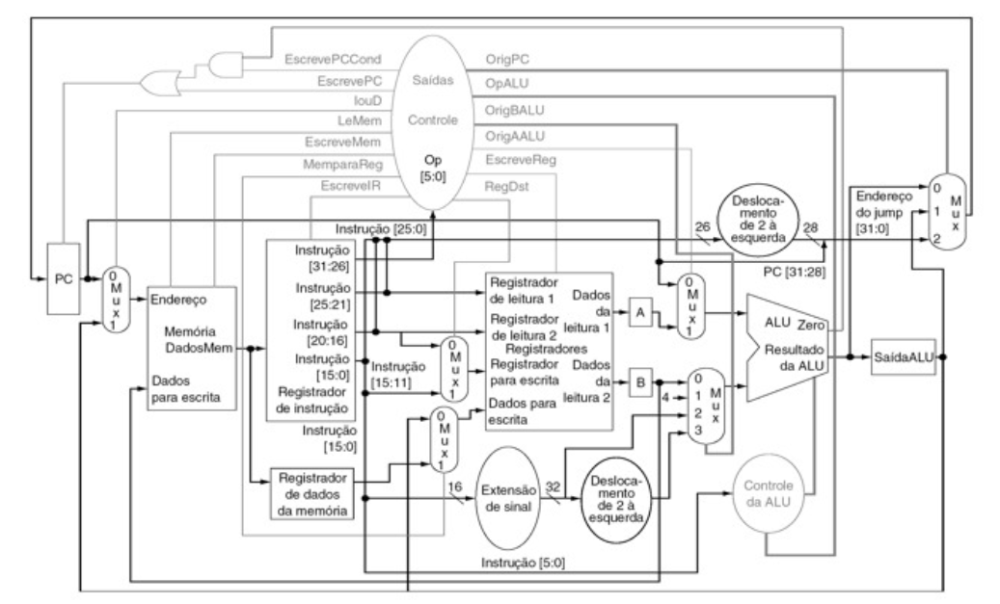

# MIPS_MULTICILO
### Projeto Final de Organizacão e Arquitetura de Computadores 2/2016

## Objetivo
Montar e simular uma versão do processador MIPS Muticilo, no ambiente *Quartus* / *ModelSim-Altera*.

  

## Descrição
O diagrama acima não suporta a execução de todas as instruções do MIPS. As instruções
básicas a serem implementadas são as seguintes:

<table align="center">
  <tr>
    <th></th>
    <th>Opcode</th>
    <th>Funct</th>
    <th>ULA</th>
  </tr>
  <tr>
    <td><b>LW</b></td>
    <td>10 1011</td>
    <td></td>
    <td></td>
  </tr>
  <tr>
    <td><b>SW</b></td>
    <td>10 0011</td>
    <td></td>
    <td></td>
  </tr>
  <tr>
    <td><b>ADD</b></td>
    <td>00 0000</td>
    <td>10 0000</td>
    <td>Sim</td>
  </tr>  
  <tr>
    <td><b>ADDi</b></td>
    <td>00 1000</td>
    <td></td>
    <td>Sim</td>
  </tr>  
  <tr>
    <td><b>SUB</b></td>
    <td>00 0000</td>
    <td>10 0010</td>
    <td>Sim</td>
  </tr> 
  <tr>
    <td><b>AND</b></td>
    <td>00 0000</td>
    <td>10 0100</td>
    <td>Sim</td>
  </tr>   
  <tr>
    <td><b>NAND</b></td>
    <td>00 0000</td>
    <td>?? ????</td>
    <td>Sim</td>
  </tr>    
  <tr>
    <td><b>OR</b></td>
    <td>00 0000</td>
    <td>10 0101</td>
    <td>Sim</td>
  </tr> 
  <tr>
    <td><b>NOR</b></td>
    <td>00 0000</td>
    <td>10 0111</td>
    <td>Sim</td>
  </tr>   
  <tr>
    <td><b>XOR</b></td>
    <td>00 0000</td>
    <td>10 0110</td>
    <td>Sim</td>
  </tr>    
  <tr>
    <td><b>SLT</b></td>
    <td>00 0000</td>
    <td>10 1010</td>
    <td>Sim</td>
  </tr>
  <tr>
    <td><b>J</b></td>
    <td>00 0010</td>
    <td></td>
    <td></td>
  </tr>  
  <tr>
    <td><b>BEQ</b></td>
    <td>00 0100</td>
    <td></td>
    <td></td>
  </tr> 
  <tr>
    <td><b>BNE</b></td>
    <td>00 0101</td>
    <td></td>
    <td></td>
  </tr>    
</table>

As instruções adicionais a serem implementadas são as seguintes:
<table align="center">
  <tr>
    <th></th>
    <th>Opcode</th>
    <th>Funct</th>
    <th>ULA</th>
  </tr>
  <tr>
    <td><b>ORi</b></td>
    <td>00 1101</td>
    <td></td>
    <td>Sim</td>
  </tr>
  <tr>
    <td><b>ANDi</b></td>
    <td>00 1100</td>
    <td></td>
    <td>Sim</td>
  </tr>  
  <tr>
    <td><b>SLL</b></td>
    <td>00 0000</td>
    <td>00 0000</td>
    <td>Sim</td>
  </tr>  
  <tr>
    <td><b>SRL</b></td>
    <td>00 0000</td>
    <td>00 0010</td>
    <td>Sim</td>
  </tr>
  <tr>
    <td><b>BGEZ</b></td>
    <td>?? ????</td>
    <td></td>
    <td></td>
  </tr> 
  <tr>
    <td><b>BLTZ</b></td>
    <td>?? ????</td>
    <td></td>
    <td></td>
  </tr>  
  <tr>
    <td><b>SLTI</b></td>
    <td>00 1010</td>
    <td></td>
    <td>Sim</td>
  </tr>    
  <tr>
    <td><b>JAL</b></td>
    <td>00 0011</td>
    <td></td>
    <td></td>
  </tr> 
  <tr>
    <td><b>JR</b></td>
    <td>00 0000</td>
    <td>00 1000</td>
    <td></td>
  </tr>    
</table>

O processador deve ser simulado no *ModelSim* e implementado em *FPGA*. Neste caso, para verificação de seu funcionamento, deve-se observar o **PC**, o **RI**, o **RDM** e a **SaidaALU** através dos mostradores de 7 segmentos.

Para entrada e saída de dados deve-se utilizar:
 - Botão para acionar o relógio;
 - Mostrador de 7 segmentos para exibir conteúdo de **RI** e **SaidaALU**.
 
O **PC** deve ter 32 bits. A memória tem apenas 256 palavras de 32 bits, de forma que apenas 8 bits do **PC** devem ser utilizados no seu endereçamento. 

Para executar um programa gerado pelo *MARS*, devem ser carregados o código e os dados do programa.

Os endereços da área de dados devem ser mapeados para a região de memória que
começa no endereço **128** no *FPGA*. Assim, o endereço de dado deve ser gerado
concatenando os bits [8 dowto 2] do **SaidaALU** com o bit ‘1’ na
posição mais significativa: ‘1’ & alu_out(8 downto 2).

Um arquivo comprimido com todos os módulos VHDL do MIPS multiciclo é
disponibilizado no Moodle. O código MIPS a ser carregado na memória está contido no
arquivo **mem.mif**.

Para exibição dos dados nos mostradores, utilizar os acionadores de display de 7
segmentos feito na primeira aula de laboratório.

A verificação do processador consistirá na execução de programas gerados a partir do
MARS.

## Entrega
15 de dezembro. Apresentar o código VHDL simulando no *ModelSim* e
executando em *FPGA*.
